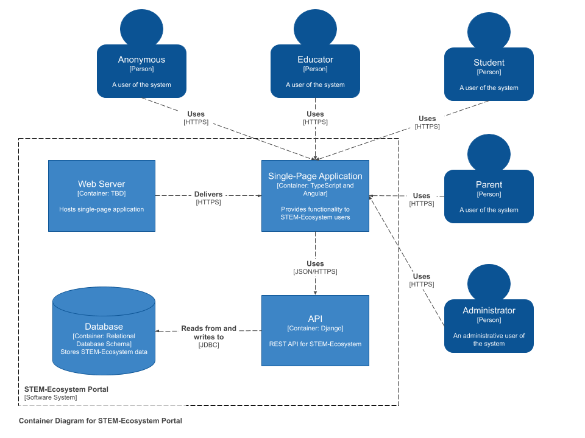

# Milestone 2

# Project Realization - Overview

Initially in Milestone 1, we planned on gathering the requirements that helps in building the appropriate backend and frontend environments. Based on the meeting with Omaha STEM Ecosystem as a team we decided to follow agile methodology. Each week we complete set of tickets on sprint basis.

As a team of 4 members, we divided work and has been working on two different portions of the project.

The major portion of the project (**Part 1**): Two team members worked on the ground work to build the environment for the frontend and backend based on the requirements we gathered from Omaha STEM Ecosystem.

The second portion of the project (**Part 2**): Started to work on the functionality (Home page with Nav bar, Registering Users page and Login) parts of the project.

# Progress:

The team has almost finished the major chunk (Part 1) of the project. Over the earlier weeks, they worked on completing the angular framework based frontend, Django based backend, and docker to run and deploy our web application using docker container. The ultimate major reason for choosing these environments is to build a secure web application. Incorporating a Django library for JWT management (JSON Web Token) is one of the ways we have integrated a tool for the purpose of security.

Since we finished building secure environments for backend and frontend, we are currently focused on implementing the major application functionalities and requirements that were discussed in the meeting with Omaha STEM Ecosystem. One of the challenges in our application is to provide a similar experience that the existing STEM Ecosystem site provides. We have identified open-source third party tools to replace the rich-content management experience that WordPress has out of the box.

We identifed the CKEditor as a tool for posting events to the site. CKEditor is a feature-rich content editor that allows for embedded links, images, font-styling, etc. We also identified [Owl Carousel](https://owlcarousel2.github.io/OwlCarousel2/) as a way to quickly display categorized events in a Netflix-like fashion. One of the controls we could not find a suitable tool for was file management (uploading files). However, we found a good place to start with an existing [library](https://github.com/LukasMarx/angular-file-manager). Integrating third-party tools such as those mentioned above is one of the unique challenges that we faced and are still working through. 

Apart from building environments and implementing functionalities, team is very concerned about security and consistency in building web application which we are implementing in our work by following proper coding standards, naming conventions and removing unnecessary objects or line in the code. Since we have many coding standards we decided to be on same page and so we review the code consistency to maintain same standard before merged into the master branch. 

# Outcomes

By the time of completion of milestone 2 we accomplished the major tasks that required to start building application functionalities. We have also completed below tickets.
* Gathering requirements for the application
* Completed building secured backend and frontend environments, incorporating JWT (JSON Web Tokens)
* Completed adding the front-page UI with a navigation bar for login/logout and setting up events
* Completed adding user registration page
* Completed adding user login page
* Completed adding page for adding new events
* Identified third party tools for content management (CKEditor 5, Owl Carousel)
* Scraped event data from the existing STEM Ecosystem site for use in our application and included it in the database migration

# Hinderances

# Ongoing Risks

# Diagrams

### System Context Diagram

### Container Diagram

### Component Diagram

### UML Activity Diagram

