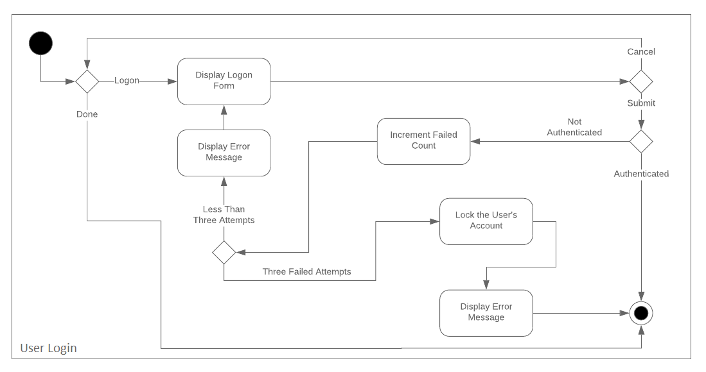

# Milestone 2

# Project Realization - Overview

Initially in Milestone 1, we planned on gathering the requirements to build the appropriate backend and frontend environments. Based on the meeting with Omaha STEM Ecosystem, we decided to follow an Agile methodology. Tickets are added to sprints each week and individual group members took on a set of tasks.

As a team of 4 members, we divided work and have been working on two different portions of the project.

The major portion of the project (**Part 1**): Two team members worked on the ground work to build the environment for the frontend and backend based on the requirements we gathered from Omaha STEM Ecosystem.

The second portion of the project (**Part 2**): Started to work on the functionality (Home page with Nav bar, Registering Users page and Login) parts of the project.

# Progress:

The team has almost finished the major chunk (Part 1) of the project. Over the earlier weeks, we worked on completing the intial build of the frontend framework (based in Angular) and backend (based in Django REST framework). Docker was also used to run and deploy our web application using Docker containers with the help of Docker Compose. The major reason of choosing these environments is to solidify the groundwork of the application in providen security practices which apply directly to our framework set. For example, we incorporated a Django library for JWT management (JSON Web Token) which is one of the ways we integrated a tool for the purpose of security.

Since we finished building secure environments for backend and frontend, we are currently very focused on implementing the major application functionalities and requirements that are discussed in the meeting with Omaha STEM Ecosystem. 

Apart from building environments, implementing application functionalities and security best practices, the team is very concerned about consistency throughout the codebase and following proper coding standards, naming conventions, and removing unnecessary objects. Since we have many coding standards, we decided to be on same page by reviewing code consistency and functionality before merging into the master branch.

# Outcomes

In reaching milestone 2, we accomplished the following major tasks that required to start building application functionalities:

* Gathered requirements for the application
* Built secured backend and frontend environments (with the help of JSON web tokens)
* Added the front-page UI with a navigation bar for login/logout and profile settings
* Added a user registration page which will link to the backend API
* Added a user login page which links to the backend API for authentication
* Added a page for adding new events which links to the backend API for saving to the production database

# Hinderances

# Ongoing Risks

# Diagrams

### System Context Diagram

### Container Diagram

### Component Diagram

### UML Activity Diagram

