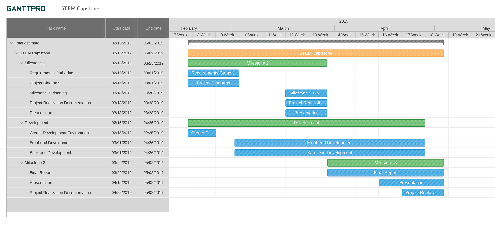

# Omaha STEM Ecosystem

## Executive Summary

It's no surprise that STEM fields are incredibly important in this day and age.
Omaha STEM Ecosystem is one of many organizations that strive to help parents,
teachers, counselors, and students connect to grow interest in these fields
early. The tricky piece is having an easy-to-use platform to facilitate this
communication. Our goal is to make this as easy as possible by building a
custom web application which achieves the following:

* Creates a community-driven portal to host and find events
* Caters recommended events based on user's interests
* Helps STEM Ecosystem collect data on event turnout and overall user interest

We believe this is an opportunity to build an experience for the next
generation of STEM students. This project will provide a portal to facilitate
communication various students and the subjects and projects they're interested
in. The end of this project will include a baseline for STEM Ecosystem to grow
into the future with their users on a scalable platform to help continue the
advancement of students in science, technology, engineering, and mathematics.

## Proposed Project Timeline

## Resources/Technology Needed

|Resource  | Dr. Hale needed? | Investigating Team member | Description |
|-------------------|---------|---------------------------|-------------|
|Development hardware| No | All | Each member will require a computer capable of running the tools needed to develop the application |
|Cloud-based hosting evironment| No | ?? | Hosting environment to be used for development and testing|
|CSS framework | No | ?? | A CSS framework will be used to provide additional UI controls and site theming |

## [Project-oriented Risk List](https://github.com/MLHale/CYBR4580-8950/blob/master/projects/milestone1.md#risk-list)

| Risk Name (value) | Impact | Likelihood | Description | Mitigation |
|-------------------------------------------------------|--------|------------|:---------------------------------------------------------------------------------------------------------------------------------------:|-----------------------------------------------------------------------------------------------------------------------------------------|
| Misunderstanding the project requirements (75) | 9 | 8 | When the requirements are not clearly understood by team. | Restrict requirements to be complete, testable, consistent, design free and unambiguous.  Use a formal platform to keep requirements and use-case diagrams. |
| Technical Debt  (50)        | 8 | 7 | High level design issues may occur while developing if a requirement changes or if the initial implementation does not meet the requirement exactly. | Use methods that are highly replaceable, extendable and reasonably simple, share concerns for design decisions. |
| Inaccurate estimations (25) | 6 | 3 | Bad estimations to complete a task or project can destroy the project planning, schedule and credibility. For example, underestimating the easy tasks and over estimating the hard tasks. | Classify tasks or 'user-stories' with an estimated number of hours and update the value as work progresses. Tag certain tasks as such for team-member awareness. |
| Team member availability (20) | 5 | 3 | Team effort is directly proportional to the application success. Team members must be able to meet and coordinate to discuss the project progress otherwise will slow down the progress. | Frequently share work and notes so another team member can pick-up a task. Break down sprints so that team-members can work in parallel even if one team-member does not complete as task. |

