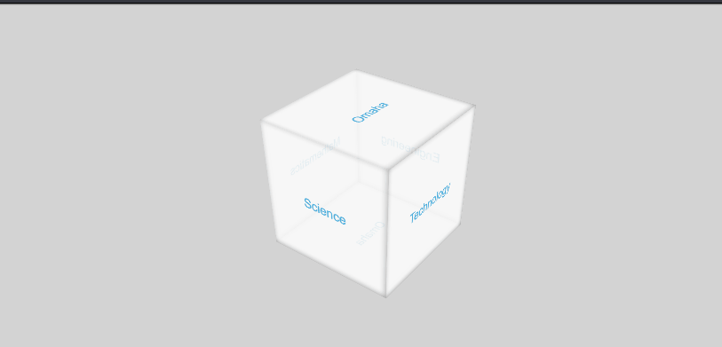

# Omaha STEM Ecosystem

## Executive Summary

It's no surprise that STEM fields are incredibly important in this day and age.
Omaha STEM Ecosystem is one of many organizations that strive to help parents,
teachers, counselors, and students connect to grow interest in these fields
early. The tricky piece is having an easy-to-use platform to facilitate this
communication. Our goal is to make this as easy as possible by building a
custom web application which achieves the following:

* Creates a community-driven portal to host and find events
* Caters recommended events based on user's interests
* Helps STEM Ecosystem collect data on event turnout and overall user interest

We believe this is an opportunity to build an experience for the next
generation of STEM students. This project will provide a portal to facilitate
communication various students and the subjects and projects they're interested
in. The end of this project will include a baseline for STEM Ecosystem to grow
into the future with their users on a scalable platform to help continue the
advancement of students in science, technology, engineering, and mathematics.

## Proposed Project Timeline

## Project-oriented Risk List

| Risk Name (value) | Impact | Likelihood | Description | Mitigation |
|-------------------------------------------------------|--------|------------|:---------------------------------------------------------------------------------------------------------------------------------------:|-----------------------------------------------------------------------------------------------------------------------------------------|
| Misunderstanding the project requirements (75) | 9 | 8 | When the requirements are not clearly understood by team. | Restrict requirements to be complete, testable, consistent, design free and unambiguous.  Use a formal platform to keep requirements and use-case diagrams. |
| Technical Debt  (50)        | 8 | 7 | High level design issues may occur while developing if a requirement changes or if the initial implementation does not meet the requirement exactly. | Use methods that are highly replaceable, extendable and reasonably simple, share concerns for design decisions. |
| Inaccurate estimations (25) | 6 | 3 | Bad estimations to complete a task or project can destroy the project planning, schedule and credibility. For example, underestimating the easy tasks and over estimating the hard tasks. | Classify tasks or 'user-stories' with an estimated number of hours and update the value as work progresses. Tag certain tasks as such for team-member awareness. |
| Team member availability (20) | 5 | 3 | Team effort is directly proportional to the application success. Team members must be able to meet and coordinate to discuss the project progress otherwise will slow down the progress. | Frequently share work and notes so another team member can pick-up a task. Break down sprints so that team-members can work in parallel even if one team-member does not complete as task. |
| Limiting project scope (30) | 5 | 3 | Implementing too many requirements and features in the project irrespective of timeline we have, could end up failing in delivery of a successful project | Planning of the each sprint and tasks to be implemented in the sprint with respect to time we have will help us in the completion of project successfully. |

## Project Metholodology

### Literature Review

Faudziah Ahmad, Fauziah Baharom and Moath Husni have done research on current web application development and measurement practices that are implemented by many small software firms. Throughout this paper discuss the best practices and techniques must be applied during the development process. The results from this paper reveal how much awareness is lacking in developers in applying the best practices during different phases (requirements, quality, measurement, design, and testing) of application development. From the result, the author suggested implementing new web application methodology that ensures the quality of the web application product. [1]

Xiaowei Li and Yuan Xue have surveyed on recent research results of the web application security outlined several security loopholes and lack of security in the evolving web application trends. In their research, they identified and described the unique security properties the secure web application must be preserved. In this paper, they clearly addressed the three main issues that are the reason for the security challenges we are facing, that requires security professionals to quickly react without leaving numerous web applications at huge risk. [2]

Prof. B Nithya Ramesh, Aashay R Amballi and Vivekananda Mahanta have done research on reasons for choosing Django The Python Web Framework among other frameworks available for us. They described the specifications and features of Django, advantages, and disadvantages of Django. In their research, they identified the security concerns such as cross-site request forgery, SQL injection, cross-site scripting, and clickjacking can be taken away very efficiently with the Django framework. They summarized their results with the assurance of using Django framework for the next 10-15 years. [3]

### Technical Plan

The first goal of this project is to gather requirements from Omaha STEM Ecosystem to determine what they're looking for in a web application. A general idea has been established, but face-to-face contact would help us in determine what they're picturing for this project. Once we have a good idea for project requirements, we'll create workflow diagrams based on C4 models to show how users will interact with the application and how each piece will function. 

Throughout the project, we'll be documenting the infrastructure and how each aspect of the application works. We knew from the start of this project that it will be passed off to a new owner after the semester ends. Therefore, documentation is key to success for the lifetime of the application. While documenting, we'll be building out the frontend and backend separately.

The backend framework will be Django. It will handle all database actions (models based on C4 diagrams) and expose that data through a REST API. The frontend, based in the Angular framework, will be a single page application the user will interact with to host and attend events. 

The overall steps for building this application is as follows:

1. Gather requirements for the application
2. Build a basic backend with `user` and `event` models
3. Install Django REST Framework for API functionality
4. Setup model serializers for API
5. Expose `user` and `event` models through the API
6. Build basic frontend Angular application
7. Add user registration page
8. Add user login page
9. Add front page UI with a navigation bar for login/logout and setting up events
10. Add events list to front page
11. Setup permissions based on user roles
12. Add page for adding new events
13. Add page for viewing/editing current events
14. Add event creation approval process
15. Add ability for users to sign up to attend events
16. Add tagging system for user interest and event types
17. Improve look and feel of working application

_Note_: The steps above are not the final list of things to accomplish. Things will surely arise and new steps will be added as we go along. The overall goal is to reach a useable product so the client has something working at the end of the semester. After we reach this point, newly added features are bonuses as they're considered stretch goals.

Security is also an important aspect of this project.  Confidentiality, integrity and availability must be maintained to ensure a secure application.  Well established security design principles will be used during the design phase of the project.  This would include principles such as:

1. Principle of least privilege
2. Establishing secure defaults
3. Failing securely
4. Reducing the attack surface

A well designed application goes a long way in providing security, but a poor implementation can result in bugs that can be exploited.  We will need to ensure that the code is free from errors and provides expected results.  To accomplish this, we will perform automated unit testing using tools such as Jasmine and Karma. '

### Proven Methods 

WordPress 

* Elegant UI out of the box, easily extendable, pluggable
* Barrier to entry, frequent updates, complexities, not easy to test/troubleshoot, lock-in

Django is a 10+ year old framework that is used by companies such as Instagram and Eventbrite. Features such as:

* Django provides many templates out of the box and open source CMS possibilities to meet the requirement of a minimal degree of content management. 

  * Administrators must be able to easily add new content and control its metadata. 
  * Django templates provide uniform styling for forms and pages provided to different users. For example, a form to 'gauge the user's interest' should look and feel the same way as the form to add a new event.

* Built-in user management to aid in the requirement of role-based access. 

* Django has a collection of third-party libraries. The Django REST framework will help the application meet the requirement of being easily accessible by external sites.

  <u>Django Release History</u>

Angular

* Angular is familiar, proven, and developed by Google.
* Angular has routing support for single-page applications, tools such as the Angular CLI (command line), and has many open source controls as part of AngularUI.
* Flexible framework with ability to include custom controls and animations

## Resources/Technology Needed

|Resource  | Dr. Hale needed? | Investigating Team member | Description |
|-------------------|---------|---------------------------|-------------|
|Development hardware| No | All | Each member will require a computer capable of running the tools needed to develop the application |
|Backend framework (Django) | No | All | Django framework will be used to develop secure backend |
|Developing web application | Yes | All | Developing secure frontend and backend of the application |
|Cloud-based hosting environment| No | Dakota (Cody) Kaup | Hosting environment to be used for development and testing |
|CSS framework | No | Joe | A CSS framework will be used to provide additional UI controls and site theming |

## References

1. https://arxiv.org/pdf/1205.6162.pdf
2. http://www.isis.vanderbilt.edu/sites/default/files/main_0.pdf
3. http://www.researchpublish.com/journal/IJCSITR/Issue-2-April-2018-June-2018/15
4. https://www.owasp.org/index.php/Security_by_Design_Principles
