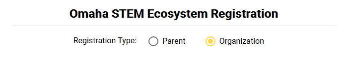
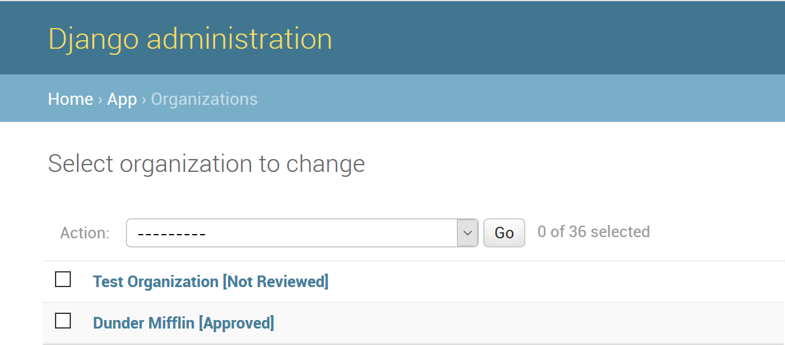
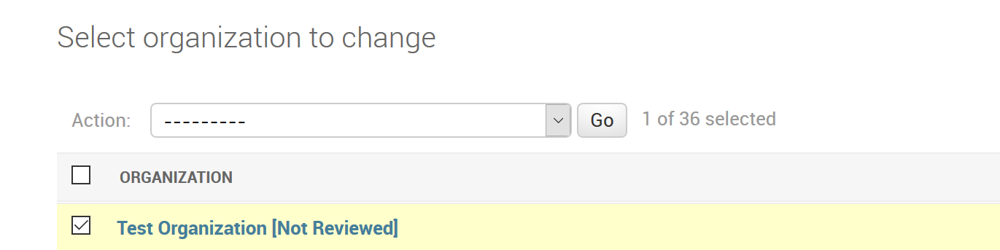
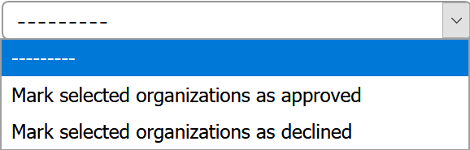

# STEM Ecosystem Portal
## Executive Summary
It's no surprise that STEM fields are incredibly important in this day and age. Omaha STEM Ecosystem is one of many organizations that strive to help parents, teachers, counselors, and students connect to grow interest in these fields early. The tricky piece is having an easy-to-use platform to facilitate this communication. Our goal is to make this as easy as possible by building a custom web application which achieves the following:
* Creates a community-driven portal to host and find events
* Caters recommended events based on user's interests
* Helps STEM Ecosystem collect data on event turnout and overall user interest

We believe this is an opportunity to build an experience for the next generation of STEM students. This project will provide a portal to facilitate communication various students and the subjects and projects they're interested in. The end of this project will include a baseline for STEM Ecosystem to grow into the future with their users on a scalable platform to help continue the advancement of students in science, technology, engineering, and mathematics.

## Project Goals
The goal is to have people go on the app to figure out what camp would be good for kids
* Collective list of available programs that lists areas of interest and prioritizes areas of interest in a Netflix bio style
* Programs are categorized or tagged
* Parents can select an area of interest to search in a specific area
* Quality programs could then be added to the database after an approval process
* Provides a mechanism for connecting people with programs
* Enrollment should not be made from the app, just a link 

## Project Methodology
* Cheap
  * Deployment/hosting/scaling
  * Develop/Maintain
* Predictable
  * ORM (Object-Relational Mapping)
  * Role-management
  * Framework adherence
* Secure
  * HTTPS
  * Permission checking
  * Input sanitization

## Results / Findings

We finally achieved our end goal of creating a secure web application that allows users (students, parents, educators, and counselors) to access the STEM events that are categorized and listed in their respective tagged technology. Using one of the secure Django REST and Angular framework, we were able to develop a decent web application that help parents, teachers, counselors and students connect to grow interest and march students with relevant STEM camps and programs in the Omaha community. This application will help the STEM Ecosystem organization in collecting the user interest data through which they can help the users by recommending events in their interested area. With the available fully functional features, we believe Omaha STEM Ecosystem organization can take up this project to next level with the continuation of work.

In reaching end of the course work, we accomplished the following major functionalities.
* Built secured backend and frontend environments (with the help of JSON web tokens)
* Added the front-page UI with a navigation bar for login/logout and profile settings
* Added a user registration page which will link to the backend API
* Added a user login page which links to the backend API for authentication
* Added a page for adding new events which links to the backend API for saving to the production database
* Events are listed in their own respective tagged technology
* Search functionality has been implemented
* For the User Registration we are validating each input given by the user on frontend and backend.
* For the Login functionality we are handling the sessions and token management.
* Since the application has different users, users are constrained to activities to perform on the page based on their role such as
  * Students cannot create child account and cannot see the parent profile
  * Only approved educators can add new events
  * Parents can create child accounts
  * Only Admin can unlock the locked user account, can approve new user account.
  * To prevent the brute force attack, implemented the password lockout feature after 3 unsuccessful login attempts.

## Setting up the Development Environment
_Note_: If you're using `docker-compose`, you can skip to [this section](#docker-compose-setup).

### Python virtual environment (virtualenv)

For this project, we want to keep all packages separate from your personal
setup. To do that, we'll use [virtualenv](https://pypi.org/project/virtualenv/).

To install, we'll just use pip:

    pip install virtualenv

After that, we can create virtual environments! Navigate to the root directory
of the `STEM-CAPSTONE-2019` project and use:

    virtualenv --python=python3.7 .venv

_Note_: I had issues on my Windows machine with the Python path so you may need to point the Python argument directly to your `python.exe` file. Just make sure you're using a version of Python 3.7! Here's what I did (my Python install is in C:\\):

    virtualenv --python "C:\\Python\\python.exe" .venv

This will create a new folder called `.venv` with all the necessary binary files
for Python to function. However, we're still not done, we need to activate it.

Unix Systems (MacOS/Linux)

    source .venv/bin/activate

Windows Systems

    .venv\Scripts\activate

You should see an indicator in your shell with `(.venv)` if it worked! Now whenever
we install Python packages, they'll be added to that environment. We can easily jump
out whenever using:

    deactivate

### Installing project packages

All required packages can be found in a file called `requirements.txt` in the root
directory of the project. This makes it easy to install everything you need with
the following:

    pip install -r requirements.txt

If you need to add a package to the project for something you're working on, you can
update that list with:

    pip freeze > requirements.txt

### Django Secret Key

Django automatically adds a secret key variable for all sorts of security things.
It's a terrible idea to include that in version control. The best way to remove this
piece is to use an environment variable (currently called `STEM_SECRET_KEY`).

Unix Systems (MacOS/Linux)

    # bash
    echo 'export STEM_SECRET_KEY="SECRET KEY HERE"' >> ~/.bashrc
    source ~/.bashrc

    # zsh
    echo 'export STEM_SECRET_KEY="SECRET KEY HERE"' >> ~/.zshrc
    source ~/.zshrc

Windows Systems

    setx STEM_SECRET_KEY "SECRET KEY HERE"

_Note_: With Windows systems, you'll have to restart your shell but you can run `set` to get a list of available environment variables and it should be listed there.

#### Generate a new secret key

The easiest way I've found to generate a secret key for your dev environment is to
run the following:

    python -c 'import random; result = "".join([random.choice("abcdefghijklmnopqrstuvwxyz0123456789!@#$%^&*(-_=+)") for i in range(50)]); print(result)'

Thankfully it's just a development environment so security isn't nearly as important so this
should do the trick for us.

### Postgres setup

For this project, we'll be using PostgreSQL as a backend database. We'll want to have this setup in your development environment as well.

#### Download and install

You'll want to downlaod and install PostgreSQL onto your system through their [site](https://www.postgresql.org/download/). Any version is fine as long as it's above 9.4.

    Super User Password: Whatever you want
    Port: Default (5432)
    Locale: Default

#### Create a new database

Launch the PostgreSQL manager (I do it though the `psql` command in my terminal) and create the database by:

    CREATE database stem_ecosystem;

#### Create database admin user

Now that we have a database created, we'll want to create some credentials to connect with:

    CREATE USER stem_admin WITH ENCRYPTED PASSWORD 'stemecosystem';
    GRANT ALL PRIVILEGES ON DATABASE stem_ecosystem TO stem_admin;
    ALTER USER stem_admin CREATEDB; /* Add ability to create databases for Django testing */

_Note_: We made the password `stemecosystem` in development since it's a local environment but this will be different in production.

#### Add PostgreSQL admin user to environment variable

We'll be using an environment variable called `STEM_PSQL_PASSWORD` so we'll want to add that as well:

Unix Systems (MacOS/Linux)

    # bash
    echo 'export STEM_PSQL_PASSWORD="stemecosystem"' >> ~/.bashrc
    source ~/.bashrc

    # zsh
    echo 'export STEM_PSQL_PASSWORD="stemecosystem"' >> ~/.zshrc
    source ~/.zshrc

Windows Systems

    setx STEM_PSQL_PASSWORD "stemecosystem"

_Note_: With Windows systems, you'll have to restart your shell but you can run `set` to get a list of available environment variables and it should be listed there.

#### Populate the database

If all the steps above worked, we can populate the database with our project tables! To do that we can use:

    python manage.py migrate

You should see Django do its thing and create the tables needed for the app.

Now that we have the tables, we can add some sample data with our custom [fixtures](https://docs.djangoproject.com/en/2.1/howto/initial-data/)!

    python manage.py loaddata initial_data
	

### Front-end Application

#### Install NodeJS

Download and install [NodeJS](https://nodejs.org/en/).  Current LTS version may be used.

#### Install VS Code

Download and install [VS Code](https://code.visualstudio.com/) or another code editor.

#### Building the application

Change into the app directory STEM-Capstone-2019\src\frontend and run the following:

    npm install
    ng build --watch --outputPath=../static/

This will install all application dependences and build the application.  The application will be placed in the Django static files folder.  The --watch parameter will send updated files to the static files folder as changes to the application are saved.  This will continue to run in a terminal window until CTRL-C is used to terminate it.

#### Accessing the application from Django

Start Django

    python manage.py runserver 0.0.0.0:8000

Access the application from the URL http://localhost:8000

### Docker Compose Setup

#### Install docker-compose

[Here](https://docs.docker.com/compose/install/) is a helpful link for installing `docker-compose` unless you're using a desktop install. In which case, `docker-compose` should already be available to you! You can check by running the following:

```
docker-compose --version
```

#### Setting up environment variables

For this project, we're using environment variables to set secret keys and passwords so they're not hosted in our git repository. We need to setup the following:

```
STEM_SECRET_KEY - Used for the Django secret key in `settings.py`
STEM_PSQL_PASSWORD - Used as the Postgres database administrator password
```

Unix Systems (MacOS/Linux)

    # bash
    echo 'export STEM_SECRET_KEY="<SECRET_KEY_HERE>"' >> ~/.bashrc
    echo 'export STEM_PSQL_PASSWORD="stemecosystem"' >> ~/.bashrc
    source ~/.bashrc

    # zsh
    echo 'export STEM_SECRET_KEY="<SECRET_KEY_HERE>"' >> ~/.zshrc
    echo 'export STEM_PSQL_PASSWORD="stemecosystem"' >> ~/.zshrc
    source ~/.zshrc

Windows Systems

    setx STEM_SECRET_KEY "<SECRET_KEY_HERE>"
    setx STEM_PSQL_PASSWORD "stemecosystem"

_Note_: With Windows systems, you'll have to restart your shell but you can run `set` to get a list of available environment variables and it should be listed there.

If you need help setting up a secret key, you can refer to the [Generate a New Secret Key](#generate-a-new-secret-key) section.

#### Build and run

Once you have docker-compose installed and running, you can build and run your development environment!

```
# If you want to follow the server output
docker-compose up

# If you want to run the containers in the background
docker-compose up -d
```

#### Access application

Once everything is up and running (which takes some time for Angular to compile), you should be able to navigate to either the frontend or backend endpoint to see the application!

```
Frontend: http://127.0.0.1:4200
Backend: http://127.0.0.1:8000
```

The frontend serves all frontend assets through `ng serve` and polls file changes every 2 seconds. Therefore, you can update anything on the frontend and your browser should automatically refresh after Angular is finished recompiling the changes.

The backend will be used for anything Django related. At this time, this consists of `/admin` and `/api` paths.

##### Default superadmin

The default superadmin account uses the following credentials:

```
Username: root
Password: stemecosystem
```

##### Windows-specific issues

With Windows systems, you'll be running the containers in a virtual machine. So we'll need to get the IP address of that machine. I use [Docker Toolbox](https://docs.docker.com/toolbox/toolbox_install_windows/) so I can use VirtualBox instead of Hyper-V. Therefore, I use the following to get the IP address:

```
# "box" is my Docker virtual machine name, yours may be different
docker-machine env box
```

In the output of that command should include `DOCKER_HOST` which contains an IP address. Put that address in your browser and it should pull up the app (http://<DOCKER_HOST_ADDRESS>:8000 or http://<DOCKER_HOST_ADDRESS>:4200)!

#### Shutdown containers

To shutdown the project whenver you don't want them running, you can use:

```
docker-compose down
```

## Setting up production

This guide will discuss setting up a production environment for this application.

### Install NodeJS

Download and install NodeJS from their [website](https://nodejs.org/en/). I recommend grabbing the closest version to the [frontend Dockerfile](./src/frontend/Dockerfile).

### Globally install some packages

There are a couple packages we'll need to install for Angular to play nice. These are available in the [frontend Dockerfile](./src/frontend/Dockerfile) as well but you'll need to run the following:

```
npm install -g @angular/cli@7.3.1
npm install -g node-sass
```

_Note_: The VM I was working with had a previous install that used `root` so I also had to run `npm -g config set user root` before both of the above lines to get everything to work right. I **DO NOT** recommend doing that on a public-facing server.

Now that we have those pieces installed, you should be able to run `ng --version` and get some output. If you do, then Angular is installed and we can move forward!

### Install application packages

Next, we'll want to install all packages required for the app. To that, we'll let `npm` do its thing.

```
cd src/frontend
npm install
```

That install might take some time but everything should install without too many issues.

### Build production static files

After all dependencies are installed, we can actually build the app! To do that, we can run:

```
cd src/frontend # If you're not already there
ng build --prod
```

That build command will package everything up for you based on the settings we have set in the production environment file. Once that wraps up, we can start the containers!

### Add environment variables

In this project, we used a couple environment variables to setup the Django secret key and the Postgres admin password. Create these couple variables before starting `docker-compose`:

#### Django secret key

Unix Systems (MacOS/Linux)

    # bash
    echo 'export STEM_SECRET_KEY="SECRET KEY HERE"' >> ~/.bashrc
    source ~/.bashrc

    # zsh
    echo 'export STEM_SECRET_KEY="SECRET KEY HERE"' >> ~/.zshrc
    source ~/.zshrc

Windows Systems

    setx STEM_SECRET_KEY "SECRET KEY HERE"

_Note_: With Windows systems, you'll have to restart your shell but you can run `set` to get a list of available environment variables and it should be listed there.

#### Postgres admin password

Unix Systems (MacOS/Linux)

    # bash
    echo 'export STEM_PSQL_PASSWORD="stemecosystem"' >> ~/.bashrc
    source ~/.bashrc

    # zsh
    echo 'export STEM_PSQL_PASSWORD="stemecosystem"' >> ~/.zshrc
    source ~/.zshrc

Windows Systems

    setx STEM_PSQL_PASSWORD "stemecosystem"

_Note_: With Windows systems, you'll have to restart your shell but you can run `set` to get a list of available environment variables and it should be listed there.

### Start docker-compose

If you're still sitting in the `src/frontend` directory, you'll want to go back to the root directory of the project with `../../`.  Once there, you can run the following to get the Docker containers up and running:

```
docker-compose -f docker-compose-prod.yml up -d
```

That command will gather everything you need for the application and spin up the containers to deliver the service. They will be ran in a `detached` state so you won't see any log output but you can get after the fact with:

```
docker-compose logs -f
```

### Navigate to the application

Now that our containers are up and running, we can navigate to the server URL to see our working app! Congratulations

## Documentation
### How to Create Organization Accounts
The application allows orgranizations to create accounts from the registration page. New organization users will be able to login to the application, but will not be able to create events until they are approved by an administrator.
1. With no one logged in, click the __Register__ link at the top of the page 
2. Change the registration type from __Parent__ to __Organization__ 

3. Enter the form information and click __Complete Registration__

### How to Approve/Decline Organization Accounts
An administrator must approve an organization before the user can create events.  This is accomplished from the Django Administration site.
1. Open the Django Administration site and login as an admin user
2. Click on __Organizations__ on the left side of the page
3. A list of the organizations and their status will be shown


4. Click the checkbox infront of the organization to review


5. Click the drop-down box at the top of the page
6. Select either __approved__ or __declined__ and then click the __Go__ button


### How Child Accounts Get Created From Parent Accounts
The application does not allow children to create their own accounts.  A parent must register for the site and then create accounts that be used by their children.  Each of these child accounts will be linked back to the parent and the parent can delete them at any time.

#### Creating Child Accounts
1. Log into the application as a parent user
2. Click the round button at the top right corner of the page
3. Click My Profile
4. The parent user's information will be displayed along with any existing child accounts at the bottom of the page
5. Click the "+" button to register a new child
6. Enter the requested information and click create
7. The process can be canceled at any time by clicking the "cancel" button

#### Updating/Deleting Child Account
1. Login to the application as a parent user and open the My Profile
2. Locate the child to be updated and the bottom of the page and click the box
3. A update page will be displayed that allows the parent to update the information or delete the account entirely
4. The update process can be canceled at any time by clicking the "cancel" button

### Login Activity Log
All attempts to login to the system, whether successful or not, will be logged by the system.  This log can be viewed from the Django Administration site.

#### Viewing the Log
1. Open the Django Administration site and login as an admin user
2. Click on User_login_activites on the left side of the page
3. A list of all the login attempts and the result will be displayed 
